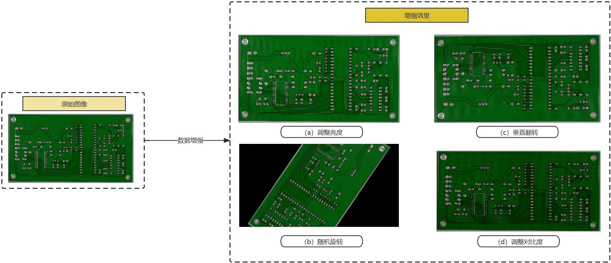
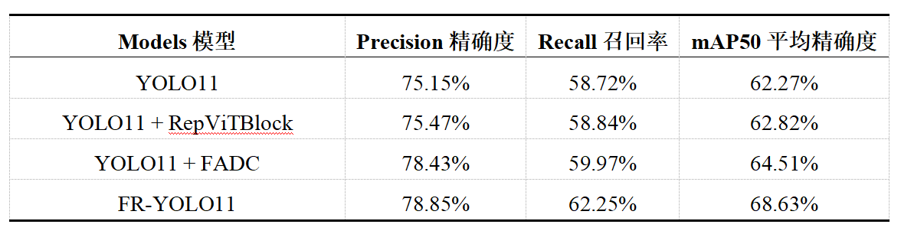
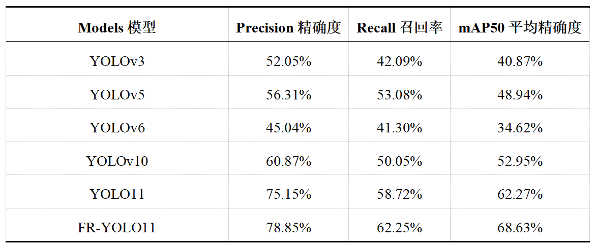

# 🔍 基于 **FR-YOLO11** 的 PCB 板缺陷检测

> 📍 **项目作者：** Jia’nan Zhao  
> 📅 **时间：** 2024‑11‑18  
> 🛠️ **模型结构：** YOLO11 + FADC + RepViTBlock  
> 打造一套轻量高效、精度领先的工业缺陷检测解决方案  


<div align="center">

| Precision | Recall | mAP<sub>50</sub> |
|-----------|--------|------------------|
| **78.85 %** | **62.25 %** | **68.63 %** |

*相较 YOLO11：+3.7 pp / +3.5 pp / +6.4 pp*

</div>

---

## 目录
1. [项目背景](#项目背景)  
2. [模型整体框架](#模型整体框架)  
3. [关键改进模块](#关键改进模块)  
   * RepViTBlock  
   * FADC  
4. [数据集与预处理](#数据集与预处理)  
5. [实验设置](#实验设置)  
6. [结果与分析](#结果与分析)  
7. [快速上手](#快速上手)  
8. [结语与展望](#结语与展望)  

---

## 项目背景
PCB（Printed Circuit Board）是电子产品的“神经网络”，任何微小缺陷都可能导致整机失效。  
传统 AOI 方案依赖规则 + 人工复检，效率与一致性受限。深度学习检测方案虽然精准，却常面临 **算力瓶颈** 与 **小样本难题**。  

**FR‑YOLO11** 在 YOLO11 主干中引入轻量 Transformer 风格的 **RepViTBlock** 与频域自适应卷积 **FADC**，即便仅使用 **693 → 1386** 张合成数据训练，仍取得业界领先检测性能。

---

## 模型整体框架

```mermaid
graph LR
  A[YOLO11 + RepViTBlock] --> D[FADC (AdaDR + AdaKern + FreqSelect)]
  D --> B[FPN + PAN]
  B --> C[Decoupled CLS & REG]
```

* **Backbone**：在 YOLO11 主干多处卷积块替换为 **RepViTBlock**，提升特征表达同时保持速度。  
* **Neck**：沿用 FPN/PAN 进行多尺度特征融合。  
* **Head**：解耦分类与回归分支，使用 CIoU 损失。  
* **FADC**：旁路插入，高频细节与低频语义双重兼顾。

---

## 关键改进模块

### 1. RepViTBlock —— 轻量 Transformer × CNN
* **Token Mixer**：3 × 3 深度可分卷积负责空间信息采样。  
* **Channel Mixer**：1 × 1 卷积重塑通道关系。  
* **结构重参数化**：训练期多分支 → 推理期单分支，显著降低延迟与显存占用。  

### 2. FADC —— Frequency‑Adaptive Dilated Convolution

| 组件 | 作用 |
|------|------|
| **AdaDR** | 根据局部频谱动态调整扩张率：边缘用小 _d_，背景用大 _d_ |
| **AdaKern** | 将卷积核权重拆分为高/低频子核，自适应加权 |
| **FreqSelect** | 抑制无用高频，聚焦目标区域 |

---

## 数据集与预处理

| 属性 | 说明 |
|------|------|
| **来源** | 北大 Intelligent Robot Lab 公开合成 PCB 缺陷集 *prototype* |
| **原图数量** | 693 → 经数据增强扩充至 **1 386** 张 |
| **缺陷类型** | 漏孔 *missing_hole* / 鼠咬 *mouse_bite* / 开路 *open_circuit* / 短路 *short* / 杂散 *spur* / 杂铜 *spurious_copper* |
| **划分比例** | 7 : 2 : 1 （Train : Val : Test） |
| **增强策略** | HSV 抖动 · 镜像 · CutMix · Mosaic |



---

## 实验设置

| 参数 | 详情 |
|------|------|
| **GPU** | NVIDIA RTX 4070 16 GB |
| **Framework** | Python 3.10 · PyTorch 2.2.1 · CUDA 12.2 |
| **Epochs** | 100（Cosine 动态 LR 衰减） |
| **Batch Size** | 64 |
| **初始 LR** | 0.01 |
| **优化器** | Adam |
| **IoU 阈值** | 0.5 |

---

## 结果与分析

### 消融实验

| 模型 | Precision | Recall | mAP<sub>50</sub> |
|------|-----------|--------|------------------|
| YOLO11 原始 | 75.15 | 58.72 | 62.27 |
| + RepViTBlock | 76.47 | 60.81 | 64.52 |
| + FADC | 76.47 | 59.94 | 64.52 |
| **FR‑YOLO11** | **78.85** | **62.25** | **68.63** |



### 各缺陷类别准确率提升

* *missing_hole* ↑ 3 pp  
* *mouse_bite* ↑ 9 pp  
* *spurious_copper* ↑ 10 pp  

低召回瓶颈显著改善，小样本缺陷识别效果尤为突出。

### 对比实验

FR‑YOLO11 在精度上领先 YOLOv3/v5/v6/v10 至少 **+15 pp mAP<sub>50</sub>**。



---


### 🚀 快速上手

#### 📁 1. 克隆项目仓库

```bash
git clone https://github.com/xiaoguan-ai/FR-YOLO11.git
```

#### 📂 2. 进入项目目录

```bash
cd FR-YOLO11
```

#### 🧱 3. 创建 Conda 环境并激活（推荐使用）

```bash
conda env create -f environment.yml
```

```bash
conda activate fryolo11
```

#### 📦 4. 准备数据集目录结构

```bash
mkdir -p datasets/PCB/images
mkdir -p datasets/PCB/labels
```

（将你的图片和标签文件分别放到上述两个文件夹中）

---

### 🏋️‍♀️ 模型训练（Train）

#### 使用 yolov11n.pt 权重进行训练（图像尺寸为 640）

```bash
python train.py --img 640 --batch 64 --epochs 100 --data pcb.yaml --weights yolov11n.pt --project runs/fryolo11
```

---

### 🔍 模型推理（Detect）

#### 使用训练好的 best.pt 模型进行预测

```bash
python detect.py --weights runs/fryolo11/weights/best.pt --source sample_pcb.jpg
```

---


> **Tip：** 若算力有限，可切换 `--weights yolov11s.pt` 并将输入尺寸降为 `--img 512`，在移动端亦可实时运行。

---

## 结语与展望
FR‑YOLO11 通过 **频域自适应** + **轻量 Transformer** 的双重强化，为 PCB 缺陷检测带来 **“精度‑效率兼得”** 的全新范式。  
后续工作将尝试：

* 蒸馏 + 少样本增量学习  
* 引入实时伺服反馈，实现生产线闭环纠错  
* 迁移到更多工业检测场景（BGA 焊点、锂电极片等）

欢迎 **⭐Star / Fork / Issue** 共同推进！
